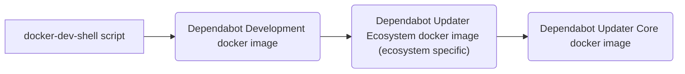
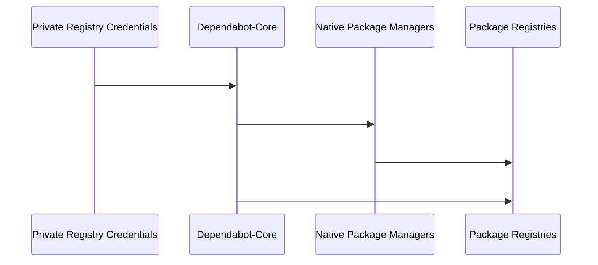
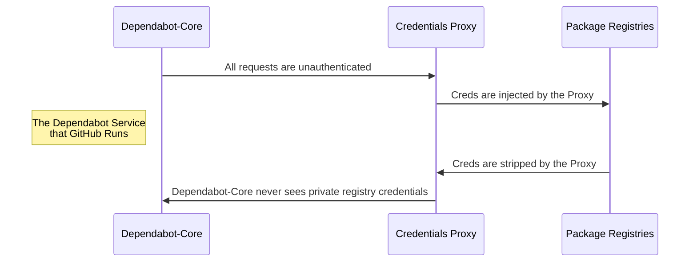

<h1 align="center">
    <picture>
        <source media="(prefers-color-scheme: light)" srcset="https://user-images.githubusercontent.com/7659/174594540-5e29e523-396a-465b-9a6e-6cab5b15a568.svg">
        <source media="(prefers-color-scheme: dark)" srcset="https://user-images.githubusercontent.com/7659/174594559-0b3ddaa7-e75b-4f10-9dee-b51431a9fd4c.svg">
        
    </picture>
</h1>

Welcome to the public home of Dependabot :dependabot:.

# Table of Contents

- [What is Dependabot-Core?](#what-is-dependabot-core)
- [How to run Dependabot](#how-to-run-dependabot)
- [Contributing to Dependabot](#contributing-to-dependabot)
  - [Reporting Issues and Feature Requests](#reporting-issues-and-feature-requests)
  - [Submitting Pull Requests](#submitting-pull-requests)
- [Development Guide](#development-guide)
  - [Getting a Development Environment Running](#getting-a-development-environment-running)
  - [Debugging Problems](#debugging-problems)
  - [Running Tests](#running-tests)
  - [Profiling](#profiling)
- [Architecture and Code Layout](#architecture-and-code-layout)
- [License and Project History](#license-and-project-history)
- [Notes for Project Maintainers](#notes-for-project-maintainers)

---

# What is Dependabot-Core?

Dependabot-Core is the library at the heart of [Dependabot](https://docs.github.com/en/code-security/dependabot) security / version updates.

Use it to generate automated pull requests updating dependencies for projects written in Ruby, JavaScript, Python,
PHP, Dart, Elixir, Elm, Go, Rust, Java and .NET. It can also update git submodules, Docker files, and Terraform files.
Features include:

- Check for the latest version of a dependency *that's resolvable given a project's other dependencies*
- Generate updated manifest and lockfiles for a new dependency version
- Generate PR descriptions that include the updated dependency's changelogs, release notes, and commits

# How to run Dependabot

Most people are familiar with the Dependabot service that runs on GitHub.com and GitHub Enterprise. Enabling that is as
simple as [checking a `dependabot.yml` configuration file in to your repository's `.github` directory](https://docs.github.com/en/code-security/dependabot/dependabot-version-updates/configuring-dependabot-version-updates).

However, if you want to run a custom version of Dependabot or run it on another platform, you're not left out in the cold.
This repo provides the logic necessary for hosting your own standalone Dependabot, as long as you're [not re-selling
Dependabot to others](#license). It currently supports opening Pull Requests against repositories hosted on GitHub, Github Enterprise, Azure DevOps, GitLab, BitBucket, and AWS CodeCommit.

Dependabot-Core is a library, so you'll need an entrypoint script of some kind. Here are a few examples to help you get
started.

>**Note:** If you're looking to run Dependabot locally for development/debugging purposes, see the [Development Guide](#development-guide).

## Dependabot-Script

The [dependabot-script](https://github.com/dependabot/dependabot-script) repo provides a collection of example scripts for configuring the Dependabot-Core library.
It is intended as a starting point for advanced users to run a self-hosted version of Dependabot within their own projects.

## Dependabot CLI

The [Dependabot CLI](https://github.com/dependabot/cli) is a newer tool that may eventually replace [`dependabot-script`](#dependabot-script) for standalone use cases.
While it creates dependency diffs, it's currently missing the logic to turn those diffs into actual PR's. Nevertheless, it
may be useful for advanced users looking for examples of how to hack on Dependabot.

# Contributing to Dependabot

## Reporting issues and Feature Requests

👋 Want to give us feedback on Dependabot, or contribute to it? That's great - thank you so much!

### Reproducible Example

Most bug reports should be accompanied by a link to a public repository that reproduces the problem. Bug reports that
cannot be reproduced on a public repo using the [CLI tool](#cli-tool) or [dry-run script](#dry-run-script) may be
closed as "cannot reproduce".

### No "+1" Comments

Our issue tracker is quite active, and as a result there's a good chance someone already filed the same issue. If so,
please upvote that issue, because we use 👍 reactions on issues as one signal to gauge the impact of a feature request or bug.

However, please do not leave comments that contribute nothing new to the discussion. For details, see [https://github.com/golang/go/wiki/NoPlusOne](https://github.com/golang/go/wiki/NoPlusOne). This is open source, if you see something you want fixed, we are happy to coach you through contributing a pull request to fix it.

### Don't file issues about Security Alerts or Dependency Graph

The issue-tracker is meant solely for issues related to Dependabot's updating logic. Issues about [security alerts](https://docs.github.com/en/code-security/dependabot/dependabot-alerts/about-dependabot-alerts) or [Dependency Graph](https://docs.github.com/en/code-security/supply-chain-security/understanding-your-software-supply-chain/about-the-dependency-graph) should instead be filed as a [Code Security discussion](https://github.com/orgs/community/discussions/categories/code-security).

A good rule of thumb is that if you have questions about the _diff_ in a PR, it belongs here.

### Disclosing Security Issues

If you believe you have found a security vulnerability in Dependabot please submit the vulnerability to GitHub Security [Bug Bounty](https://bounty.github.com/) so that we can resolve the issue before it is disclosed publicly.

## Submitting Pull Requests

Want to contribute to Dependabot? That's great - thank you so much!

Contribution workflow:
1. Fork the project.
2. Get the [development environment running](#getting-a-development-environment-running).
3. Make your feature addition or bug fix.
4. Add [tests for it](#running-tests). This is important so we don't break it in a future version unintentionally.
5. Send a pull request. The tests will run on it automatically, so don't worry if you couldn't get them running locally.

Please refer to the [CONTRIBUTING](CONTRIBUTING.md) guidelines for more information.

### New Ecosystems

Currently, the Dependabot team is not accepting support for new ecosystems. We are prioritising upgrades to already supported ecosystems at this time.

Please refer to the [CONTRIBUTING](CONTRIBUTING.md) guidelines for more information.

# Development Guide

## Getting a Development Environment Running

The first step to debugging a problem or writing a new feature is getting a development environment going. We provide a
custom [Docker-based](https://www.docker.com/products/docker-desktop/) developer shell that bakes in all required dependencies.
In most cases this is the best way to work with the project.

The developer shell uses volume mounts to incorporate your local changes to Dependabot's source code. This way you can
edit locally using your favorite editor and the changes are immediately reflected within the docker container for performing
[dry-runs](#debugging-problems) or executing [tests](#running-tests).
Note: See caveat about [editing the native package manager helper scripts](#making-changes-to-native-package-manager-helpers).

### Quickstart

The script to launch the developer shell builds the docker images from scratch if it can't find them locally. This can take a while.

Skip the wait by pulling the pre-built image for the ecosystem you want to work on. The image name uses the [YAML ecosystem name](https://docs.github.com/en/code-security/dependabot/dependabot-version-updates/configuration-options-for-the-dependabot.yml-file#package-ecosystem)
to specify the ecosystem.  For example, for Go Modules, the YAML name is `gomod`:

```shell
$ docker pull ghcr.io/dependabot/dependabot-updater-gomod
```

>**Note:** Pre-built images are currently only available for AMD64 / Intel architecture. They _will_ run on ARM, but 2x-3x slower than if you [manually build ARM-specific images](#building-images-from-scratch).

Next, run the developer shell, specifying the desired ecosystem _using the top-level directory name of the ecosystem in this project_. For example, for Go Modules, the top-level directory is named `go_modules`:

```shell
$ bin/docker-dev-shell go_modules
=> running docker development shell
[dependabot-core-dev] ~/dependabot-core $
[dependabot-core-dev] ~/dependabot-core $ cd go_modules && rspec spec # to run tests for a particular package
```

### Building Images from Scratch

Normally the [Quickstart](#quickstart) is all you need, but occasionally you'll need to rebuild the underlying images.

For example, while we don't yet publish ARM-specific images, if you _are_ working on an ARM-based platform, we recommend
manually building the images because the resulting containers run much faster.

The developer shell runs within a Dependabot Development docker image, which is built on top of an ecosystem image.



Changes to the docker files for any of these images requires building one or more of the images locally in order to be reflected in the development shell.

The simple but slow way is to delete any existing images and then run `bin/docker-dev-shell` which automatically builds
missing images.

The faster way is to pull all the pre-built images that are dependencies of the image you actually need to build.
To (re)build a specific one:

- The Updater core image:

  ```shell
  $ docker pull ghcr.io/dependabot/dependabot-updater-core # OR
  $ docker build Dockerfile.updater-core # recommended on ARM
  ```

- The Updater ecosystem image:

  ```shell
  $ docker pull ghcr.io/dependabot/dependabot-updater-gomod # OR
  $ script/build go_modules # recommended on ARM
  ```

- The development container using the `--rebuild` flag:

  ```shell
  $ bin/docker-dev-shell go_modules --rebuild
  ```

### Making Changes to native Package Manager helpers

Several Dependabot packages make use of 'native helpers', small executables in their host language.

**Changes to these files are not automatically reflected inside the development container.**

Once you have made any edits to the helper files, run the appropriate build script to update the
installed version with your changes like so:

```bash
$ bin/docker-dev-shell bundler
=> running docker development shell
$ bundler/helpers/v2/build
$ bin/dry-run.rb bundler dependabot/demo --dir="/ruby"
```

To view logs and stdout from the native package manager helpers, see [debugging native helpers](#debugging-native-package-manager-helpers).

# Debugging Problems

The first step to debugging is getting the [development environment running](#getting-a-development-environment-running).

Within the development environment, you have two options for simulating a dependency update job:
You can use the newly-developed [CLI tool](#cli-tool) or the original [Dry-run script](#dry-run-script).

## CLI tool

The [Dependabot CLI](https://github.com/dependabot/cli) is a newly-developed tool that incorporates the [GitHub
Credentials Proxy](#private-registry-credential-management) to more realistically simulate what's happening within
the Dependabot-at-GitHub service when talking to private registries.

It has a [dedicated debugging guide](https://github.com/dependabot/cli#debugging-with-the-cli), including support for dropping into the Ruby debugger.

## Dry-Run Script

>Note: Before running the dry-run script, you'll need to [get the development environment running](#getting-a-development-environment-running).

You can use the `bin/dry-run.rb` script to simulate a dependency update job, printing
the diff that would be generated to the terminal. It takes two positional
arguments: the package manager and the GitHub repo name (including the
account):

```bash
$ bin/docker-dev-shell go_modules
=> running docker development shell
$ bin/dry-run.rb go_modules rsc/quote
=> fetching dependency files
=> parsing dependency files
=> updating 2 dependencies
...
```

### Helpful options to speed up dry-run testing

The [Dry-Run script](#dry-run-script) supports many other options, all of which are documented at the [top of the script's source code](bin/dry-run.rb). For example:

1. `LOCAL_GITHUB_ACCESS_TOKEN="fake-GitHub-PAT"` allows specifying a [GitHub Personal Access Token (PAT)](https://docs.github.com/en/authentication/keeping-your-account-and-data-secure/creating-a-personal-access-token) to avoid rate-limiting.
2. `--dir="path/to/subdir/containing/manifest` is required if the manifest file is located in a subdirectory.
3. `--dep="dep-name-that-I-want-to-test"` allows specifying a single dep to try to update and all others are ignored.
4. `--cache=files` allows caching remote dep files locally for faster re-runs when testing local logic changes.
5. `--updater-options=feature_flag_name` allows passing in feature flags.

Here's an example of how to string all these together

```bash
  LOCAL_GITHUB_ACCESS_TOKEN=github_pat_123_fake_string \
  bin/dry-run.rb docker jeffwidman/secrets-store-driver \
  --dir "/manifest_staging/charts/secrets-store-provider" \
  --cache=files \
  --dep="secrets-store" \
  --updater-options=kubernetes_updates
```

### Adding debug breakpoints

You can add a `debugger` statement anywhere in the ruby code, for example:

```ruby
      def latest_resolvable_version
        debugger
        latest_version_finder.latest_version
      end
```

When you execute the job, the Ruby debugger will open. It should look something like this:

```ruby
[11, 20] in ~/go_modules/lib/dependabot/go_modules/update_checker.rb
    11|   module GoModules
    12|     class UpdateChecker < Dependabot::UpdateCheckers::Base
    13|       require_relative "update_checker/latest_version_finder"
    14|
    15|       def latest_resolvable_version
=>  16|         debugger
    17|         latest_version_finder.latest_version
    18|       end
    19|
    20|       # This is currently used to short-circuit latest_resolvable_version,
=>#0    Dependabot::GoModules::UpdateChecker#latest_resolvable_version at ~/go_modules/lib/dependabot/go_modules/update_checker.rb:16
  #1    Dependabot::GoModules::UpdateChecker#latest_version at ~/go_modules/lib/dependabot/go_modules/update_checker.rb:24
  # and 9 frames (use `bt' command for all frames)
(rdbg)
```

At this prompt, you can run [debugger commands](https://github.com/ruby/debug) to navigate around, or enter methods and variables to see what they contain. Try entering `dependency` to see what dependency Dependabot is currently working on.

>**Note** While in the debugger, changes made to the source code will not be picked up. You will have to end your debugging session and restart it.

### Debugging Native Package Manager Helpers

When you're debugging an issue you often need to peek inside these scripts that run in a separate process.

Print all log statements from native helpers using `DEBUG_HELPERS=true`:

```bash
DEBUG_HELPERS=true bin/dry-run.rb bundler dependabot/demo --dir="/ruby"
```

Pause execution to debug a single native helper function using `DEBUG_FUNCTION=<function name>`. The function maps to a
native helper function name, for example, one of the functions in `bundler/helpers/v2/lib/functions.rb`.

When this function is being executed a `debugger` is inserted, pausing execution of the `bin/dry-run.rb` script, this leaves the current updates `tmp` directory in place allowing you to `cd` into the directory and run the native helper function directly:

```bash
 DEBUG_FUNCTION=parsed_gemfile bin/dry-run.rb bundler dependabot/demo --dir="/ruby"
=> fetching dependency files
=> dumping fetched dependency files: ./dry-run/dependabot/demo/ruby
=> parsing dependency files
$ cd /home/dependabot/dependabot-core/tmp/dependabot_TEMP/ruby && echo "{\"function\":\"parsed_gemfile\",\"args\":{\"gemfile_name\":\"Gemfile\",\"lockfile_name\":\"Gemfile.lock\",\"dir\":\"/home/dependabot/dependabot-core/tmp/dependabot_TEMP/ruby\"}}" | BUNDLER_VERSION=1.17.3 BUNDLE_GEMFILE=/opt/bundler/v1/Gemfile GEM_HOME=/opt/bundler/v1/.bundle bundle exec ruby /opt/bundler/v1/run.rb
```

Copy and run the `cd...` command:

```bash
cd /home/dependabot/dependabot-core/tmp/dependabot_TEMP/ruby && echo "{\"function\":\"parsed_gemfile\",\"args\":{\"gemfile_name\":\"Gemfile\",\"lockfile_name\":\"Gemfile.lock\",\"dir\":\"/home/dependabot/dependabot-core/tmp/dependabot_TEMP/ruby\"}}" | BUNDLER_VERSION=1.17.3 BUNDLE_GEMFILE=/opt/bundler/v1/Gemfile GEM_HOME=/opt/bundler/v1/.bundle bundle exec ruby /opt/bundler/v1/run.rb
```

This should log out the output of the `parsed_gemfile` function:

```ruby
{"result":[{"name":"business","requirement":"~> 1.0.0","groups":["default"],"source":null,"type":"runtime"},{"name":"uk_phone_numbers","requirement":"~> 0.1.0","groups":["default"],"source":null,"type":"runtime"}]}
```

Keep in mind that unlike changes to the ruby source, changes on your host machine to the native helpers source code are
not synced to the development container. So you have two choices for editing the native helper:

- You can directly edit the temporary copy of the native helper within the development container, for example: `vi /opt/bundler/v1/lib/functions/file_parser.rb`. And then re-run the `cd...` command. This is the fastest way to debug, but any changes won't be saved outside the container.
- You can edit your local copy, and then [rebuild the native helper](#making-changes-to-native-package-manager-helpers). This will require re-running the dry-run script to pickup the change.

### Debugging Ignore Conditions

Most of the ecosystems in Dependabot-Core support `ignore` conditions which allow a user to specify dependency names or
versions to exclude from upgrades. The docs for the Dependabot service at GitHub [describe the feature in more detail](https://docs.github.com/en/code-security/dependabot/dependabot-version-updates/configuration-options-for-the-dependabot.yml-file#ignore).

The [Dependabot CLI](#cli-tool) supports passing in ignore conditions as part of the job definition. See [the example](https://github.com/dependabot/cli#scenario-file).

The [dry-run script](#dry-run-script) supports passing in one or more ignore conditions via the env var `IGNORE_CONDITIONS`:

```bash
IGNORE_CONDITIONS='[{"dependency-name":"*","update-types": ["version-update:semver-major"]}]' \
bin/dry-run.rb docker test_org/test-dependabot`
```

### Debugging Security Updates

Many of the ecosystems in Dependabot-Core support [security updates](https://docs.github.com/en/code-security/dependabot/dependabot-security-updates/about-dependabot-security-updates). These are a special form of version update where a
dependency name and range of vulnerable versions are passed in. Dependabot-Core will try to upgrade any instance of that
dependency to the _minimum_ non-vulnerable version. This is in contrast to a normal version update which tries to update
to the _latest_ version.

The env var `SECURITY_ADVISORIES` allows passing one or more security alert notifications to the [dry-run script](#dry-run-script) in order to simulate a security update:

```bash
SECURITY_ADVISORIES='[{"dependency-name":"buffer","patched-versions":[],"unaffected-versions":[],"affected-versions":["<= 2.0.0"]}]' \
bin/dry-run.rb pub dart-lang/pub-dev --dir "/app" --cache=files --dep="buffer"
```

### Visual Studio Code and Docker

There's built-in support for leveraging Visual Studio Code's [ability for
debugging](https://code.visualstudio.com/docs/devcontainers/containers) inside a Docker container.
After installing the recommended [`Dev Containers` extension](https://marketplace.visualstudio.com/items?itemName=ms-vscode-remote.remote-containers),
simply press `Ctrl+Shift+P` (`⇧⌘P` on macOS) and select `Dev Containers: Reopen in Container`.
You can also access the dropdown by clicking on the green button in the bottom-left corner of the editor.
If the development Docker image isn't present on your machine, it will be built automatically.
Once that's finished, start the `Debug Dry Run` configuration `(F5)` and you'll be prompted
to select a package manager and a repository to perform a dry run on.
Feel free to place breakpoints on the code.

There is also support to debug individual test runs by running the `Debug Tests` configuration `(F5)`
and you'll be prompted to select an ecosystem and provide an rspec path.

⚠️ The `Clone Repository ...` commands of the Remote Containers extension are currently
missing some functionality and are therefore not supported. You have to clone the
repository manually and use the `Reopen in Container` or `Open Folder in Container...`
command.

## Running Tests

Once you get the [development environment for a particular ecosystem](#getting-a-development-environment-running) going,
execute the tests for that ecosystem by running `rspec spec` inside that ecosystem's folder, e.g.

```bash
$ cd go_modules
$ rspec spec
```

You can also limit the tests to only the file you're working on, or only tests that previously failed, for example:

```bash
$ rspec spec/dependabot/file_updaters/elixir --only-failures
```

Style is enforced by [RuboCop](https://rubocop.org/). To check for style violations, simply run `rubocop` in
each of the packages, e.g.

```bash
$ cd go_modules
$ rubocop
```

## Profiling

You can profile a [dry-run](#dry-run-script) by passing the `--profile` flag when running it, or tag an `rspec` test with `:profile`.
This will generate a `stackprof-<datetime>.dump` file in the `tmp/` folder, and you can generate a flamegraph from this
by running:

```bash
stackprof --d3-flamegraph tmp/stackprof-<data or spec name>.dump > tmp/flamegraph.html
```

# Architecture and Code Layout

Dependabot-Core is a collection of Ruby packages (gems), which contain the logic for updating dependencies in several languages.

### `dependabot-common`

The `common` package contains all general-purpose/shared functionality. For instance, the code for creating pull
requests for the different supported platforms lives here, as does most of the logic for handling Git dependencies (as
most languages support Git dependencies in one way or another). There are also base classes defined for each of the
major concerns required to implement support for a language or package manager.

### `dependabot-{package-manager}`

There is a gem for each package manager or language that Dependabot
supports. At a minimum, each of these gems will implement the following
classes:

| Service          | Description                                                                                   |
|------------------|-----------------------------------------------------------------------------------------------|
| `FileFetcher`    | Fetches the relevant dependency files for a project (e.g., the `Gemfile` and `Gemfile.lock`). See the [README](common/lib/dependabot/file_fetchers/README.md) for more details. |
| `FileParser`     | Parses a dependency file and extracts a list of dependencies for a project. See the [README](common/lib/dependabot/file_parsers/README.md) for more details. |
| `UpdateChecker`  | Checks whether a given dependency is up-to-date. See the [README](common/lib/dependabot/update_checkers/README.md) for more details. |
| `FileUpdater`    | Updates a dependency file to use the latest version of a given dependency. See the [README](common/lib/dependabot/file_updaters/README.md) for more details. |
| `MetadataFinder` | Looks up metadata about a dependency, such as its GitHub URL. See the [README](common/lib/dependabot/metadata_finders/README.md) for more details. |
| `Version`        | Describes the logic for comparing dependency versions. See the [hex Version class](hex/lib/dependabot/hex/version.rb) for an example. |
| `Requirement`    | Describes the format of a dependency requirement (e.g. `>= 1.2.3`). See the [hex Requirement class](hex/lib/dependabot/hex/requirement.rb) for an example. |

The high-level flow looks like this:


### `dependabot-omnibus`

This is a "meta" gem, that simply depends on all the others. If you want to
automatically include support for all languages, you can just include this gem
and you'll get all you need.

## Private Registry Credential Management

For many ecosystems, Dependabot-Core supports private registries. Sometimes this happens by passing the private registry
credentials directly to the native package managers (`npm`, `pip`, `bundler`, etc), other times it happens within the
Dependabot-Core Ruby code.



While simple and straightforward, this is a security risk for ecosystems that allow running untrusted code within their
manifest files. For example `setup.py` and `.gemspec` allow running native Python and Ruby code. If a package in the
dependency tree gets hacked, an attacker could push a malicious manifest that forces the native package manager to
expose the creds.

To guard against this, for the Dependabot service that Github runs, we wrap Dependabot-Core with a credential proxy so
those private registry secrets are never exposed to Dependabot-Core.



This also means if Dependabot-Core ever has a security vulnerability, those creds are still not at risk of being exposed.

# License and Project History

## Why is this public?

As the name suggests, Dependabot-Core is the core of Dependabot (the rest of the
app is pretty much just a UI and database). If we were paranoid about someone
stealing our business then we'd be keeping it under lock and key.

Dependabot-Core is public because we're more interested in it having an
impact than we are in making a buck from it. We'd love you to use
[Dependabot](https://docs.github.com/en/code-security/dependabot) so that we can continue to develop it, but if you want
to build and host your own version then this library should make doing so a
*lot* easier.

If you use Dependabot-Core then we'd love to hear what you build! If you are curious about what we are currently working on, [check out our public board!](https://github.com/orgs/dependabot/projects/5/views/6)

## License

We use the License Zero Prosperity Public License, which essentially enshrines
the following:

- If you would like to use Dependabot-Core in a non-commercial capacity, such as
  to host a bot at your workplace, then we give you full permission to do so. In
  fact, we'd love you to and will help and support you however we can.
- If you would like to add Dependabot's functionality to your for-profit
  company's offering then we DO NOT give you permission to use Dependabot-Core
  to do so.

All contributions to Dependabot Core implicitly transfer the IP of that contribution to
GitHub, Inc. where it will be licensed the same way as above.

## History

Dependabot and Dependabot-Core started life as [Bump](https://github.com/gocardless/bump) and
[Bump Core](https://github.com/gocardless/bump-core), back when Harry and Grey were working at
[GoCardless](https://gocardless.com). We remain grateful for the help and support of
GoCardless in helping make Dependabot possible - if you need to collect
recurring payments from Europe, check them out.

# Notes for project maintainers

<details><summary>:book: Release guide</summary>
<p>

Publish a new release to RubyGems by running the ["Gems - Bump Version" workflow](https://github.com/dependabot/dependabot-core/actions/workflows/gems-bump-version.yml) and following the instructions on the job summary.

In a nutshell the process will be:

1. Run the action to generate a version bump PR.
2. Merge the PR.
3. Tag that merge commit as a new release using the format `v1.2.3`. The job summary contains a URL pre-populated with the correct version for the title and tag.
4. Once the release is tagged, another GitHub Action workflow automatically pushes it to RubyGems.

</p>
</details>
