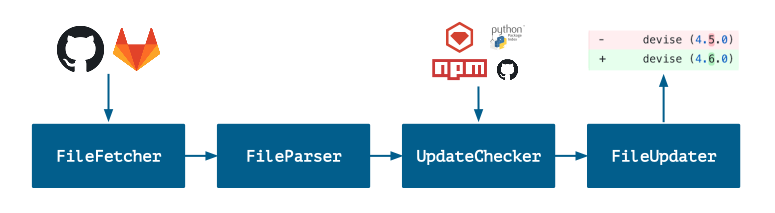

<h1 align="center">
    <picture>
        <source media="(prefers-color-scheme: light)" srcset="https://user-images.githubusercontent.com/7659/174594540-5e29e523-396a-465b-9a6e-6cab5b15a568.svg">
        <source media="(prefers-color-scheme: dark)" srcset="https://user-images.githubusercontent.com/7659/174594559-0b3ddaa7-e75b-4f10-9dee-b51431a9fd4c.svg">
        
    </picture>
</h1>

Welcome to the public home of Dependabot. This repository serves 2 purposes:

1. It houses the source code for Dependabot Core, which is the heart of [Dependabot][dependabot]. Dependabot Core handles the logic for updating dependencies on GitHub (including GitHub Enterprise), GitLab, and Azure DevOps. If you want to host your own automated dependency update bot then this repo should give you the tools you need. A reference implementation is available [here][dependabot-script].
2. It is the public issue tracker for issues related to Dependabot's updating logic. For issues about Dependabot the service, please contact [GitHub support][support]. While the distinction between Dependabot Core and the service can be fuzzy, a good rule of thumb is if your issue is with the _diff_ that Dependabot created, it belongs here and for most other things the GitHub support team is best equipped to help you.

## Got feedback?

https://github.com/github/feedback/discussions/categories/dependabot-feedback

## Contributing to Dependabot

Currently, the Dependabot team is not accepting support for new ecosystems. We are prioritising upgrades to already supported ecosystems at this time.

Please refer to the [CONTRIBUTING][contributing] guidelines for more information.

### Disclosing security issues

If you believe you have found a security vulnerability in Dependabot please submit the vulnerability to GitHub Security [Bug Bounty](https://bounty.github.com/) so that we can resolve the issue before it is disclosed publicly.

## What's in this repo?

Dependabot Core is a collection of packages for automating dependency updating
in Ruby, JavaScript, Python, PHP, Elixir, Elm, Go, Rust, Java and
.NET. It can also update git submodules, Docker files, and Terraform files.
Highlights include:

- Logic to check for the latest version of a dependency *that's resolvable given
  a project's other dependencies*
- Logic to generate updated manifest and lockfiles for a new dependency version
- Logic to find changelogs, release notes, and commits for a dependency update

## Other Dependabot resources

In addition to this library, you may be interested in the [dependabot-script][dependabot-script] repo,
which provides a collection of scripts that use this library to update dependencies on GitHub Enterprise, GitLab,
BitBucket or Azure DevOps.

## Cloning the repository
Clone the repository with Git using:

```
git clone https://github.com/dependabot/dependabot-core.git
```

On Windows this might fail with "Filename too long". To solve this, run the
following commands in the cloned Git repository:

1. `git config core.longpaths true`
2. `git reset --hard`

You can read more about this in the [Git for Windows wiki](https://github.com/git-for-windows/git/wiki/Git-cannot-create-a-file-or-directory-with-a-long-path).

## Setup

To run all of Dependabot Core, you'll need Ruby, Python, PHP, Elixir, Node, Go,
Elm, and Rust installed. However, if you just wish to run it for a single
language you can get away with just having that language and Ruby.

While you can run Dependabot Core without Docker, we provide a development
Dockerfile that bakes in all required dependencies. In most cases this is the
best way to work with the project.

## Running with Docker

Start by pulling the developer image from the [GitHub Container Registry][ghcr-core-dev] and then start the developer shell:

```shell
$ docker pull ghcr.io/dependabot/dependabot-core-development:latest
$ docker tag ghcr.io/dependabot/dependabot-core-development dependabot/dependabot-core-development
$ bin/docker-dev-shell
=> running docker development shell
[dependabot-core-dev] ~/dependabot-core $
```

### Dry run script

You can use the "dry-run" script to simulate a dependency update job, printing
the diff that would be generated to the terminal. It takes two positional
arguments: the package manager and the GitHub repo name (including the
account):

```bash
$ bin/docker-dev-shell
=> running docker development shell
$ bin/dry-run.rb go_modules rsc/quote
=> fetching dependency files
=> parsing dependency files
=> updating 2 dependencies
...
```

Note: If the dependency files are not in the top-level directory, then you must
also pass the path to the subdirectory as an argument: `--dir /<subdirectory>`.

### Running the tests

Run the tests by running `rspec spec` inside each of the packages, e.g.

```bash
$ cd go_modules
$ bundle exec rspec spec
```

Style is enforced by RuboCop. To check for style violations, simply run `rubocop` in
each of the packages, e.g.

```bash
$ cd go_modules
$ bundle exec rubocop
```

### Making changes to native helpers

Several Dependabot packages make use of 'native helpers', small executables in their host language.

**Changes to these files are not automatically reflected inside the development container**

Once you have made any edits to the helper files, run the appropriate build script to update the
installed version with your changes like so:

```bash
$ bin/docker-dev-shell
=> running docker development shell
$ bundler/helpers/v1/build
$ bin/dry-run.rb bundler dependabot/demo --dir="/ruby"
```

### Debugging native helpers

When you're making changes to native helpers or debugging a customer issue you often need to peek inside these scripts that run in a separate process.

Print all log statements from native helpers:

```bash
DEBUG_HELPERS=true bin/dry-run.rb bundler dependabot/demo --dir="/ruby"
```

Pause execution to debug a single native helper function:

```bash
DEBUG_FUNCTION=parsed_gemfile bin/dry-run.rb bundler dependabot/demo --dir="/ruby"
```

The function maps to a native helper function name, for example, one of the functions in `bundler/helpers/v2/lib/functions.rb`.

When this function is being executed a `debugger` is inserted, pausing execution of the `bin/dry-run.rb` script, this leaves the current updates tmp directory in place allowing you to cd into the directory and run the native helper function directly:

```bash
 DEBUG_FUNCTION=parsed_gemfile bin/dry-run.rb bundler dependabot/demo --dir="/ruby"
=> fetching dependency files
=> dumping fetched dependency files: ./dry-run/dependabot/demo/ruby
=> parsing dependency files
$ cd /home/dependabot/dependabot-core/tmp/dependabot_TEMP/ruby && echo "{\"function\":\"parsed_gemfile\",\"args\":{\"gemfile_name\":\"Gemfile\",\"lockfile_name\":\"Gemfile.lock\",\"dir\":\"/home/dependabot/dependabot-core/tmp/dependabot_TEMP/ruby\"}}" | BUNDLER_VERSION=1.17.3 BUNDLE_GEMFILE=/opt/bundler/v1/Gemfile GEM_HOME=/opt/bundler/v1/.bundle bundle exec ruby /opt/bundler/v1/run.rb
```

Copy and run the `cd... ` command:

```bash
cd /home/dependabot/dependabot-core/tmp/dependabot_TEMP/ruby && echo "{\"function\":\"parsed_gemfile\",\"args\":{\"gemfile_name\":\"Gemfile\",\"lockfile_name\":\"Gemfile.lock\",\"dir\":\"/home/dependabot/dependabot-core/tmp/dependabot_TEMP/ruby\"}}" | BUNDLER_VERSION=1.17.3 BUNDLE_GEMFILE=/opt/bundler/v1/Gemfile GEM_HOME=/opt/bundler/v1/.bundle bundle exec ruby /opt/bundler/v1/run.rb
```

This should log out the output of the `parsed_gemfile` function:

```
{"result":[{"name":"business","requirement":"~> 1.0.0","groups":["default"],"source":null,"type":"runtime"},{"name":"uk_phone_numbers","requirement":"~> 0.1.0","groups":["default"],"source":null,"type":"runtime"}]}
```

Edit the native helper function and re-run the above, for example: `vi /opt/bundler/v1/lib/functions/file_parser.rb`.

### Building the development image from source

The developer shell uses volume mounts to incorporate your local changes to Dependabot's source
code. If you need to make changes to the development shell itself, you can rebuild it locally.

Start by building the initial Dependabot Core image, or pull it from the
Docker registry.

```shell
$ docker pull dependabot/dependabot-core # OR
$ docker build -f Dockerfile -t dependabot/dependabot-core . # This may take a while
```

Once you have the base Docker image, you can build and run the development
container using the `docker-dev-shell` script. The script will automatically
build the container if it's not present and can be forced to rebuild with the
`--rebuild` flag. The image includes all dependencies, and the script runs the
image, mounting the local copy of Dependabot Core so changes made locally will
be reflected inside the container. This means you can continue to use your
editor of choice while running the tests inside the container.

```shell
$ bin/docker-dev-shell
=> building image from Dockerfile.development
=> running docker development shell
[dependabot-core-dev] ~/dependabot-core $
[dependabot-core-dev] ~/dependabot-core $ cd go_modules && rspec spec # to run tests for a particular package
```

## Running locally on your computer

To work with Dependabot packages on your local machine you will need Ruby and the package's specific language installed.

For some languages there are additional steps required, please refer to the README file in each package.

## Debugging with Visual Studio Code and Docker

There's built-in support for leveraging Visual Studio Code's [ability for
debugging][vsc-remote-containers] inside a Docker container.
After installing the recommended [`Remote - Containers` extension][vsc-remote-containers-ext],
simply press `Ctrl+Shift+P` (`⇧⌘P` on macOS) and select `Remote-Containers: Reopen in Container`.
You can also access the dropdown by clicking on the green button in the bottom-left corner of the editor.
If the development Docker image isn't present on your machine, it will be built automatically.
Once that's finished, start the `Debug Dry Run` configuration `(F5)` and you'll be prompted
to select a package manager and a repository to perform a dry run on.
Feel free to place breakpoints on the code.

There is also support to debug individual test runs by running the `Debug Tests` configuration `(F5)`
and you'll be prompted to select an ecosystem and provide an rspec path.

⚠️ The `Clone Repository ...` commands of the Remote Containers extension are currently
missing some functionality and are therefore not supported. You have to clone the
repository manually and use the `Reopen in Container` or `Open Folder in Container...`
command.

## Releasing

Triggering the jobs that will push the new gems is done by following the steps below.

- Ensure you have the latest merged changes:  `git checkout main` and `git pull`
- Generate an updated `CHANGELOG`, `version.rb`, and the rest of the needed commands:  `bin/bump-version.rb patch`
- Edit the `CHANGELOG` file and remove any entries that aren't needed
- Run the commands that were output by running `bin/bump-version.rb patch`

## Architecture

Dependabot Core is a collection of Ruby packages (gems), which contain the
logic for updating dependencies in several languages.

### `dependabot-common`

The `common` package contains all general-purpose/shared functionality. For
instance, the code for creating pull requests via GitHub's API lives here, as
does most of the logic for handling Git dependencies (as most languages support
Git dependencies in one way or another). There are also base classes defined for
each of the major concerns required to implement support for a language or
package manager.

### `dependabot-{package-manager}`

There is a gem for each package manager or language that Dependabot
supports. At a minimum, each of these gems will implement the following
classes:

| Service          | Description                                                                                   |
|------------------|-----------------------------------------------------------------------------------------------|
| `FileFetcher`    | Fetches the relevant dependency files for a project (e.g., the `Gemfile` and `Gemfile.lock`). See the [README](https://github.com/dependabot/dependabot-core/blob/main/common/lib/dependabot/file_fetchers/README.md) for more details. |
| `FileParser`     | Parses a dependency file and extracts a list of dependencies for a project. See the [README](https://github.com/dependabot/dependabot-core/blob/main/common/lib/dependabot/file_parsers/README.md) for more details. |
| `UpdateChecker`  | Checks whether a given dependency is up-to-date. See the [README](https://github.com/dependabot/dependabot-core/tree/main/common/lib/dependabot/update_checkers/README.md) for more details. |
| `FileUpdater`    | Updates a dependency file to use the latest version of a given dependency. See the [README](https://github.com/dependabot/dependabot-core/tree/main/common/lib/dependabot/file_updaters/README.md) for more details. |
| `MetadataFinder` | Looks up metadata about a dependency, such as its GitHub URL. See the [README](https://github.com/dependabot/dependabot-core/tree/main/common/lib/dependabot/metadata_finders/README.md) for more details. |
| `Version`        | Describes the logic for comparing dependency versions. See the [hex Version class](https://github.com/dependabot/dependabot-core/blob/main/hex/lib/dependabot/hex/version.rb) for an example. |
| `Requirement`    | Describes the format of a dependency requirement (e.g. `>= 1.2.3`). See the [hex Requirement class](https://github.com/dependabot/dependabot-core/blob/main/hex/lib/dependabot/hex/requirement.rb) for an example. |

The high-level flow looks like this:



### `dependabot-omnibus`

This is a "meta" gem, that simply depends on all the others. If you want to
automatically include support for all languages, you can just include this gem
and you'll get all you need.

## Profiling

You can profile a dry-run by passing the `--profile` flag when running it, or
tag an rspec test with `:profile`. This will generate a
`stackprof-<datetime>.dump` file in the `tmp/` folder, and you can generate a
flamegraph from this by running:
`stackprof --d3-flamegraph tmp/stackprof-<data or spec name>.dump > tmp/flamegraph.html`.

## Why is this public?

As the name suggests, Dependabot Core is the core of Dependabot (the rest of the
app is pretty much just a UI and database). If we were paranoid about someone
stealing our business then we'd be keeping it under lock and key.

Dependabot Core is public because we're more interested in it having an
impact than we are in making a buck from it. We'd love you to use
[Dependabot][dependabot] so that we can continue to develop it, but if you want
to build and host your own version then this library should make doing so a
*lot* easier.

If you use Dependabot Core then we'd love to hear what you build!

## License

We use the License Zero Prosperity Public License, which essentially enshrines
the following:
- If you would like to use Dependabot Core in a non-commercial capacity, such as
  to host a bot at your workplace, then we give you full permission to do so. In
  fact, we'd love you to and will help and support you however we can.
- If you would like to add Dependabot's functionality to your for-profit
  company's offering then we DO NOT give you permission to use Dependabot Core
  to do so. Please contact us directly to discuss a partnership or licensing
  arrangement.

If you make a significant contribution to Dependabot Core then you will be asked
to transfer the IP of that contribution to GitHub Inc. so that it can be
licensed in the same way as the above.

## History

Dependabot and Dependabot Core started life as [Bump][bump] and
[Bump Core][bump-core], back when Harry and Grey were working at
[GoCardless][gocardless]. We remain grateful for the help and support of
GoCardless in helping make Dependabot possible - if you need to collect
recurring payments from Europe, check them out.


[dependabot]: https://dependabot.com
[dependabot-status]: https://api.dependabot.com/badges/status?host=github&identifier=93163073
[dependabot-script]: https://github.com/dependabot/dependabot-script
[contributing]: https://github.com/dependabot/dependabot-core/blob/main/CONTRIBUTING.md
[bump]: https://github.com/gocardless/bump
[bump-core]: https://github.com/gocardless/bump-core
[gocardless]: https://gocardless.com
[ghcr-core-dev]: https://github.com/dependabot/dependabot-core/pkgs/container/dependabot-core-development
[support]: https://support.github.com/
[vsc-remote-containers]: https://code.visualstudio.com/docs/remote/containers
[vsc-remote-containers-ext]: https://marketplace.visualstudio.com/items?itemName=ms-vscode-remote.remote-containers
