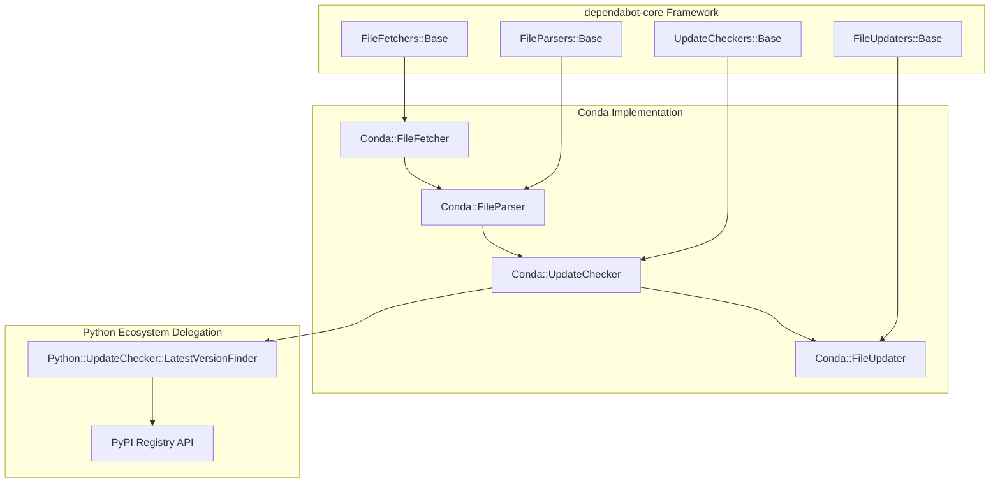
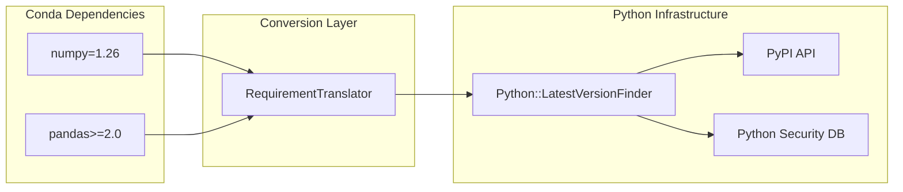
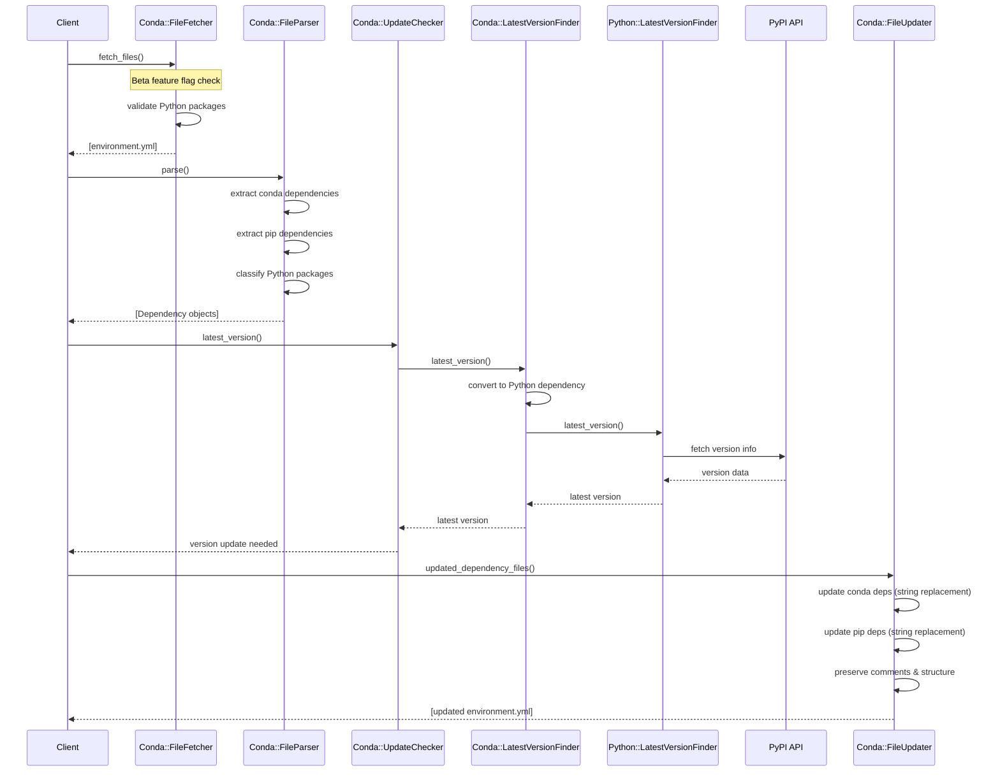
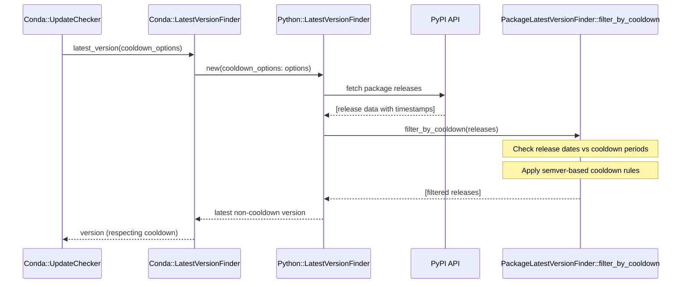
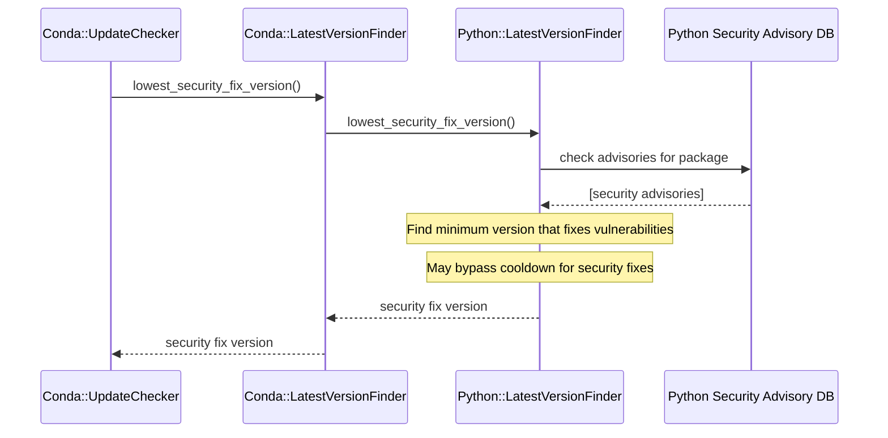

# Conda Implementation in `dependabot-core`

## Table of Contents

1. [Overview](#overview)
2. [High-Level Architecture](#high-level-architecture)
3. [Core Implementation Classes](#core-implementation-classes)
4. [Data Flow & Sequence Diagrams](#data-flow--sequence-diagrams)
5. [Implementation Details](#implementation-details)
6. [Key Design Decisions](#key-design-decisions)
7. [Testing Architecture](#testing-architecture)
8. [Integration Points](#integration-points)
9. [Development Workflow](#development-workflow)

---

## Overview

### What is the Conda Implementation?

The Conda ecosystem implementation in `dependabot-core` provides automated dependency management for Python packages specified in Conda `environment.yml` files. This implementation focuses exclusively on Python packages while leveraging existing Python/PyPI infrastructure for maximum reliability and maintainability.

### Strategic Scope

**✅ Supported:**

- Python packages from conda channels (main dependencies section)
- Python packages from pip (pip dependencies section)
- Version checking via PyPI delegation
- Security updates via Python advisory database
- Comment and formatting preservation
- Cooldown feature support

**❌ Explicitly Excluded:**

- Non-Python packages (R, C/C++, system tools)
- Fully qualified conda specifications with build strings
- Lock file support (conda-lock.yml)
- Cross-language dependency management

---

## Key Design Decisions

### 1. Python-Only Strategic Scope

**Decision**: Focus exclusively on Python packages from both conda and pip sources in Conda manifest files.

**Rationale**:
- ✅ Serves majority use case (most conda users primarily use Python)
- ✅ Leverages existing Python/PyPI GitHub Advisory Database
- ✅ Avoids complexity of cross-language dependency management
- ✅ Enables immediate value delivery

**Implementation**: `PythonPackageClassifier` with blocklist approach for distinguishable R and system tools but treat every dependency as python by default and delegate to the python implementation. Uses semantic dependency groups: `groups: ["dependencies"]` for conda dependencies and `groups: ["pip"]` for pip dependencies, enabling clear separation and targeted updates.

### 2. Delegation to Python Ecosystem

**Decision**: Delegate version checking to existing Python infrastructure instead of implementing conda-specific registry integration.

**Rationale**:
- ✅ Reuses battle-tested PyPI integration
- ✅ Inherits all Python ecosystem improvements automatically
- ✅ Consistent behavior across Python and conda ecosystems
- ✅ Reduced maintenance burden

**Implementation**: `LatestVersionFinder` inherits from `PackageLatestVersionFinder` and delegates to `Python::UpdateChecker::LatestVersionFinder`.

### 3. String-Based File Updates

**Decision**: Use string replacement instead of YAML parsing/dumping for file updates.

**Rationale**:
- ✅ Preserves original formatting, comments, and structure
- ✅ Maintains developer-friendly file appearance
- ✅ Avoids YAML library formatting inconsistencies
- ✅ Enables surgical updates without affecting unrelated content

**Implementation**: Sophisticated regex patterns that capture and preserve formatting.

### 4. Tiered Environment Support

**Decision**: Implement three-tier support model based on environment complexity.

**Rationale**:
- ✅ **Tier 1** (Simple specs): Full management capability
- ✅ **Tier 2** (Mixed): Pip-only management with clear communication
- ✅ **Tier 3** (Fully qualified): Graceful rejection with explanation

**Implementation**: `fully_qualified_package?` detection via `=` character counting.

### 5. Beta Feature Flag Protection

**Decision**: Protect all functionality behind `allow_beta_ecosystems?` feature flag.

**Rationale**:
- ✅ Safe rollout mechanism
- ✅ Allows testing without affecting production users
- ✅ Standard pattern for new ecosystem introduction
- ✅ Easy activation/deactivation

**Implementation**: Feature flag check in `FileFetcher` with clear error messages.

---

## High-Level Architecture

### `dependabot-core` Architecture Integration

The Conda implementation follows `dependabot-core` standard four component architecture pattern:



### Python Ecosystem Delegation Strategy

**Key point**: Instead of reimplementing PyPI integration, the Conda implementation delegates version checking to the existing Python ecosystem infrastructure:



---

## Core Implementation Classes

### Key Development Files

**Core Implementation**:
- `conda/lib/dependabot/conda/` - Main implementation classes
- `conda/spec/dependabot/conda/` - Test specifications  
- `conda/spec/fixtures/` - Test data and fixtures

**Configuration**:
- `conda/dependabot-conda.gemspec` - Gem specification
- `conda/.bundle/config` - Bundle configuration
- `conda/Dockerfile` - Container configuration

### 1. FileFetcher (`conda/lib/dependabot/conda/file_fetcher.rb`)

**Purpose**: Fetches and validates conda environment files from repositories.

**Key Responsibilities**:
- ✅ Beta feature flag enforcement (`allow_beta_ecosystems?`)
- ✅ Environment file detection (`environment.yml`, `environment.yaml`)
- ✅ Python package validation via `PythonPackageClassifier`
- ✅ Tiered environment support validation

**Integration Point**: Inherits from `Dependabot::FileFetchers::Base`

**Critical Implementation Details**:
```ruby
# Beta protection - core safety mechanism
unless allow_beta_ecosystems?
  raise Dependabot::DependencyFileNotFound,
        "Conda support is currently in beta. Set ALLOW_BETA_ECOSYSTEMS=true to enable it."
end

# Tiered environment validation
def environment_contains_manageable_packages?(file)
  parsed = YAML.safe_load(file.content)
  dependencies = parsed["dependencies"] || []
  
  # Tier 1: Simple conda specs → Full support
  # Tier 2: Mixed qualified + pip → Pip-only support  
  # Tier 3: Pure qualified → No support
end
```

### 2. FileParser (`conda/lib/dependabot/conda/file_parser.rb`)

**Purpose**: Parses environment.yml files to extract Python package dependencies.

**Key Responsibilities**:
- ✅ YAML parsing with error handling
- ✅ Python package classification and filtering
- ✅ Dual dependency section parsing (conda + pip)
- ✅ Complex version constraint handling
- ✅ Semantic dependency groups integration

**Integration Point**: Inherits from `Dependabot::FileParsers::Base`

**Critical Implementation Details**:
```ruby
# Intelligent package classification
def python_package?(package_name)
  PythonPackageClassifier.python_package?(package_name)
end

# Complex constraint parsing using inline regex patterns
# Conda: /^([a-zA-Z0-9_.-]+)(?:\s*(.+))?$/
# Pip: /^([a-zA-Z0-9_.-]+)(?:\s*(==|>=|>|<=|<|!=|~=)\s*([0-9][a-zA-Z0-9._+-]*))?$/

# Semantic dependency groups pattern (required by shared infrastructure)
# Conda dependencies:
{
  name: package_name,
  version: extracted_version,
  requirements: requirement_specs,
  groups: ["dependencies"], # Semantic grouping for conda deps
  package_manager: "conda"
}

# Pip dependencies:
{
  name: package_name,
  version: extracted_version,
  requirements: requirement_specs,
  groups: ["pip"], # Semantic grouping for pip deps
  package_manager: "conda"
}
```

### 3. UpdateChecker (`conda/lib/dependabot/conda/update_checker.rb`)

**Purpose**: Determines available version updates by delegating to Python ecosystem.

**Key Responsibilities**:
- ✅ Python ecosystem delegation strategy
- ✅ Cooldown feature support (`ReleaseCooldownOptions`)
- ✅ Security update integration
- ✅ Version constraint requirement handling

**Integration Point**: Inherits from `Dependabot::UpdateCheckers::Base`

**Critical Implementation Details**:
```ruby
# Delegation to Python infrastructure
def latest_version_finder
  @latest_version_finder ||= LatestVersionFinder.new(
    dependency: dependency,
    dependency_files: dependency_files,
    credentials: credentials,
    ignored_versions: ignored_versions,
    raise_on_ignored: @raise_on_ignored,
    cooldown_options: @update_cooldown, # ✅ Cooldown support
    security_advisories: security_advisories
  )
end

# Version requirement handling for updates
def update_requirement_string(requirement_string, new_version)
  case requirement_string
  when /^=([0-9])/ then "=#{new_version}"     # Conda exact
  when /^==([0-9])/ then "==#{new_version}"   # Pip exact  
  when /^>=([0-9])/ then ">=#{new_version}"   # Range constraint
  # ... additional operators
  end
end
```

### 4. LatestVersionFinder (`conda/lib/dependabot/conda/update_checker/latest_version_finder.rb`)

**Purpose**: Specialized version finder that delegates to Python ecosystem infrastructure.

**Key Responsibilities**:
- ✅ Inherits from `Dependabot::Package::PackageLatestVersionFinder`
- ✅ Cooldown functionality (`cooldown_enabled? = true`)
- ✅ Python dependency conversion
- ✅ Requirement translation (conda ↔ pip syntax)

**Integration Point**: Inherits from `Dependabot::Package::PackageLatestVersionFinder`

**Critical Implementation Details**:
```ruby
# Enable cooldown functionality
def cooldown_enabled?
  true
end

# Python ecosystem delegation
def python_latest_version_finder
  Dependabot::Python::UpdateChecker::LatestVersionFinder.new(
    dependency: python_compatible_dependency,
    # ... all parameters including cooldown_options
  )
end

# Requirement translation
def convert_conda_requirement_to_pip(conda_requirement)
  RequirementTranslator.conda_to_pip(conda_requirement)
end
```

### 5. FileUpdater (`conda/lib/dependabot/conda/file_updater.rb`)

**Purpose**: Updates environment.yml files while preserving structure and comments.

**Key Responsibilities**:
- ✅ YAML structure preservation (string-based replacement)
- ✅ Comment preservation
- ✅ Dual section updates (conda dependencies + pip dependencies)
- ✅ Multiple dependency update support

**Integration Point**: Inherits from `Dependabot::FileUpdaters::Base`

**Critical Implementation Details**:
```ruby
# String-based replacement preserves structure
def update_conda_dependency_in_content(content, dependency, new_version)
  # Regex pattern preserves channel specifications and spacing
  conda_pattern = /^(\s*-\s+(?:[a-zA-Z0-9_.-]+::)?)(#{Regexp.escape(dependency.name)})([=<>!].*)?$/
  
  # Use requirement specification, not hardcoded operators
  new_requirement = dependency.requirements.first[:requirement] || "=#{new_version}"
  
  content.gsub(conda_pattern, "\\1\\2#{new_requirement}")
end

# Comment preservation for pip dependencies
def update_pip_dependency_in_content(content, dependency, new_version)
  pip_pattern = /^(\s+)(#{Regexp.escape(dependency.name)})([=<>!~].*?)(\s*)(#.*)?$/
  # Separately captures: indent, name, requirement, whitespace, comment
end
```

### 6. Supporting Classes

#### RequirementTranslator (`conda/lib/dependabot/conda/update_checker/requirement_translator.rb`)

**Purpose**: Converts conda requirement syntax to pip-compatible syntax.

```ruby
# Wildcard expansion: =1.21.* → >=1.21.0,<1.22.0
def self.conda_to_pip(conda_requirement)
  # Handle different conda requirement patterns
  case conda_requirement
  when /^=([0-9]+(?:\.[0-9]+)*)\.\*$/
    # Handle wildcards: =1.21.* -> >=1.21.0,<1.22.0
    convert_wildcard_requirement(conda_requirement)
  when /^=([0-9]+(?:\.[0-9]+)*)$/
    # Handle exact equality: =1.2.3 -> ==1.2.3
    conda_requirement.gsub(/^=/, "==")
  # ... additional operators
  end
end
```

#### PythonPackageClassifier (`conda/lib/dependabot/conda/python_package_classifier.rb`)

**Purpose**: Determines if a package is a Python package that should be managed.

```ruby
# Blocklist approach - defaults to inclusion
NON_PYTHON_PATTERNS = T.let([
  /^r-/i,           # R packages (r-base, r-essentials, etc.)
  /^r$/i,           # R language itself
  /^python$/i,      # Python interpreter (conda-specific, not on PyPI)
  /^git$/i,         # Git version control
  # ... other non-Python packages
].freeze, T::Array[Regexp])

# Default: treat as Python package
def self.python_package?(package_name)
  # Check against blocklist, default to true
end
```

#### MetadataFinder (`conda/lib/dependabot/conda/metadata_finder.rb`)

**Purpose**: Finds package metadata by delegating to Python ecosystem infrastructure.

```ruby
# Delegates metadata finding to Python infrastructure for Python packages
def source
  return nil unless python_package?(dependency.name)
  # Would delegate to Python metadata finder logic here
  nil
end
```

#### NameNormaliser (`conda/lib/dependabot/conda/name_normaliser.rb`)

**Purpose**: Normalizes conda package names using Python package name conventions.

```ruby
def self.normalise(name)
  # Conda package names follow similar rules to Python packages
  # Convert to lowercase and replace underscores/dots with hyphens
  name.downcase.tr("_.", "-")
end
```

#### PackageManager (`conda/lib/dependabot/conda/package_manager.rb`)

**Purpose**: Defines the conda ecosystem package manager for dependabot-core framework.

```ruby
class CondaPackageManager < Dependabot::Ecosystem::VersionManager
  NAME = "conda"
  VERSION = "latest"
  
  def deprecated?
    false
  end
  
  def unsupported?
    false
  end
end
```

#### Requirement (`conda/lib/dependabot/conda/requirement.rb`)

**Purpose**: Handles conda-specific requirement parsing and comparison, supporting both conda and pip operators.

```ruby
# Support both conda and pip operators
OPS = OPS.merge(
  "=" => ->(v, r) { v == r },         # conda equality
  "==" => ->(v, r) { v == r },        # pip equality
  "~=" => ->(v, r) { v >= r && v.release < r.bump } # pip compatible release
)

# Handle conda wildcard patterns like "=1.2.*"
def convert_wildcard_requirement(req_string)
  # Convert "=1.2.*" to appropriate range constraints
end
```

#### Version (`conda/lib/dependabot/conda/version.rb`)

**Purpose**: Conda version handling that delegates to Python version since conda primarily manages Python packages.

```ruby
# Conda version handling delegates to Python version
class Version < Dependabot::Python::Version
  # Conda supports the same version formats as Python packages from PyPI
  # This includes standard semver, epochs, pre-releases, dev releases, etc.
end
```

---

## Data Flow & Sequence Diagrams

### Main Update Flow



### Cooldown Feature Flow



### Security Update Flow



---

## Testing Architecture

### Test Suite Organization

```
conda/spec/dependabot/conda/
├── file_fetcher_spec.rb           # File fetching and validation
├── file_parser_spec.rb            # YAML parsing and dependency extraction
├── file_updater_spec.rb           # File updates and preservation
├── update_checker_spec.rb         # Update checking logic
├── update_checker/
│   ├── latest_version_finder_spec.rb  # Version finding and cooldown
│   └── requirement_translator_spec.rb # Requirement translation logic
├── requirement_spec.rb            # Requirement syntax handling
├── version_spec.rb                # Version comparison logic
├── python_package_classifier_spec.rb  # Package classification
├── metadata_finder_spec.rb        # Metadata finding tests
├── name_normaliser_spec.rb        # Name normalization tests
└── fixtures/                      # Test data
    ├── environment_basic.yml
    ├── environment_complex.yml
    ├── environment_fully_qualified.yml
    ├── environment_no_pip_no_support.yml
    ├── environment_non_python.yml
    ├── environment_pip_only_support.yml
    ├── environment_simple.yml
    ├── environment_with_pip.yml
    ├── environment_files/
    │   └── basic.yml
    ├── github/                    # GitHub API mock responses
    │   ├── contents_conda_repo.json
    │   ├── contents_conda_simple.json
    │   ├── contents_conda_yaml_repo.json
    │   ├── contents_conda_yaml.json
    │   ├── contents_environment_yaml.json
    │   ├── contents_environment_yml.json
    │   ├── contents_no_conda_repo.json
    │   ├── contents_no_conda.json
    │   └── environment_simple_content.json
    └── vcr_cassettes/             # HTTP recording for external API calls
```

### Test Pattern Alignment

**Adopted from UV Ecosystem**:

- HTTP request stubbing using `repo_contents` fixtures
- Consistent `#files` describe block structure  
- VCR error elimination through proper GitHub API mocking
- Beta ecosystem protection testing

### Shared Infrastructure Testing

**Critical**: All tests validate integration with Dependabot shared infrastructure:

- Dependency objects have required `groups` key
- Constructor signatures match base class requirements
- Private method encapsulation for shared example compliance

---

## Integration Points

### 1. `dependabot-core` Framework Integration

**File Registration**:
```ruby
# conda/lib/dependabot/conda.rb
require "dependabot/conda/file_fetcher"
require "dependabot/conda/file_parser" 
require "dependabot/conda/update_checker"
require "dependabot/conda/file_updater"
require "dependabot/conda/metadata_finder"
require "dependabot/conda/requirement"
require "dependabot/conda/version"
require "dependabot/conda/name_normaliser"
# ... automatic registration with lookup tables
```

**Ecosystem Registration**:
```ruby
# Automatic registration via inheritance and explicit calls
Dependabot::FileFetchers.register("conda", Dependabot::Conda::FileFetcher)
Dependabot::FileParsers.register("conda", Dependabot::Conda::FileParser)
Dependabot::UpdateCheckers.register("conda", Dependabot::Conda::UpdateChecker)
Dependabot::FileUpdaters.register("conda", Dependabot::Conda::FileUpdater)
Dependabot::MetadataFinders.register("conda", Dependabot::Conda::MetadataFinder)
```

**Label and Production Check Registration**:
```ruby
# Pull request labeling
Dependabot::PullRequestCreator::Labeler
  .register_label_details("conda", name: "conda", colour: "44a047")

# Production dependency detection (delegates to pip group check)
Dependabot::Dependency.register_production_check(
  "conda",
  lambda do |groups|
    return true if groups.empty?
    return true if groups.include?("default")
    return true if groups.include?("dependencies")
    groups.include?("pip")
  end
)

# Name normalization (uses Python-style normalization)
Dependabot::Dependency.register_name_normaliser(
  "conda",
  ->(name) { Dependabot::Conda::NameNormaliser.normalise(name) }
)
```

### 2. Python Ecosystem Integration

**Dependency Conversion**:
```ruby
def python_compatible_dependency
  Dependabot::Dependency.new(
    name: dependency.name,
    version: dependency.version,
    requirements: python_compatible_requirements,
    package_manager: "pip" # Key conversion for PyPI compatibility
  )
end
```

**Requirement Translation**:
```ruby
# conda: =1.21.* → pip: >=1.21.0,<1.22.0
# conda: >=1.20.0 → pip: >=1.20.0 (unchanged)
```

### 3. Cooldown Feature Integration

**Base Class Integration**:
```ruby
class LatestVersionFinder < Dependabot::Package::PackageLatestVersionFinder
  def cooldown_enabled?
    true  # Enables base class cooldown functionality
  end
end
```

**Configuration Support**:
```yaml
# dependabot.yml
version: 2
updates:
  - package-ecosystem: "conda"
    cooldown:
      default-days: 5
      semver-major-days: 30
      # ... full cooldown configuration supported
```

---

## Development Workflow

### Setting Up Development Environment

1. **Start Docker Development Shell**:
```bash
bin/docker-dev-shell conda
```

2. **Run Conda Tests**:
```bash
cd conda && rspec spec
```

3. **Test with Sample Repository**:
```bash
# Full version update
bin/dry-run.rb conda theztefan/condasample --enable-beta-ecosystems

# Security updates only
SECURITY_ADVISORIES='[{"dependency-name":"numpy","patched-versions":["1.28.0"],"unaffected-versions":[],"affected-versions":["< 1.27.0"]}]' \
bin/dry-run.rb conda theztefan/condasample --enable-beta-ecosystems --security-updates-only
```

The `dsp-testing/conda-samples` repository more manifest files for testing grouped in subfolders following the three tiers support

```bash
#!/bin/bash
# Test all conda samples

REPO="dsp-testing/conda-samples"
BASE_CMD="bin/dry-run.rb conda $REPO --enable-beta-ecosystems"

echo "Testing Special Cases..."
$BASE_CMD --dir="/special-cases/private-pip-repository"
$BASE_CMD --dir="/special-cases/simplified-no-pip-base"
$BASE_CMD --dir="/special-cases/simplified-no-pip-jupyter"

echo "Testing Tier 1 - Full Support..."
$BASE_CMD --dir="/tier1-full-support-simplified-conda/astronomy-research"
$BASE_CMD --dir="/tier1-full-support-simplified-conda/basic-python-with-pip"
$BASE_CMD --dir="/tier1-full-support-simplified-conda/conda-history-export"
$BASE_CMD --dir="/tier1-full-support-simplified-conda/geospatial-datacube"
$BASE_CMD --dir="/tier1-full-support-simplified-conda/machine-learning-audio"
$BASE_CMD --dir="/tier1-full-support-simplified-conda/minimal-media-tools"
$BASE_CMD --dir="/tier1-full-support-simplified-conda/wildcards-and-channels"

echo "Testing Tier 2 - Pip Only Support..."
$BASE_CMD --dir="/tier2-pip-only-support-fully-qualified/deep-learning-gpu"
$BASE_CMD --dir="/tier2-pip-only-support-fully-qualified/pytorch-tensorboard"
$BASE_CMD --dir="/tier2-pip-only-support-fully-qualified/web-scraping-jupyter"

echo "Testing Tier 3 - No Support..."
$BASE_CMD --dir="/tier3-no-support-pure-fully-qualified/base-environment-export"
$BASE_CMD --dir="/tier3-no-support-pure-fully-qualified/machine-learning-export"
```
